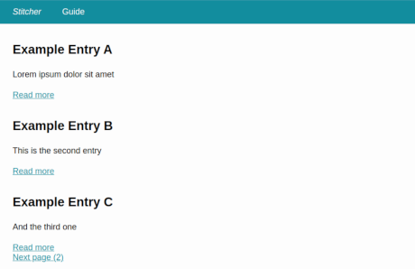

# Stitcher

**High performance, static websites for PHP developers.**



Stitcher sites utilize a simple concept that allows PHP developers to quickly publish a structured website or blog.
**Data entries** are mapped onto **templates** and “stitched” together via a **config file**.

Data entries can be provided in many ways:
JSON or YAML files, MarkDown files, images, SASS or CSS, JavaScript, folders and more.

Templates may use Twig or Smarty to output a desired HTML markup.

And the config file: well, it's a small YAML.

## Why Stitcher?

Stitcher differs from many other static site generators in two areas.
First of all: **performance is key**. Stitcher is built from its core for high performance websites.
All tools available to you put performance on the first place.
Secondly, it doesn't try to add extra syntax to existing formats. Stitcher provides a robust set of tools
**for developers** to build with, and not a lot of hacks so everything fits in one file.
 
Also important to note, included with Stitcher:

- Automatic image optimization, as easy as `image.srcset`
- HTTP/2 server push support
- Markdown, YAML and JSON
- Twig and Smarty support
- Data set overviews and details; pagination, sorting and filtering
- Built-in SASS support
- JavaScript and CSS minification
- Built-in SEO and meta tag optimizations
- CLI to run common actions

## Setup

```bash
composer create-project pageon/stitcher
```

For development purposes you may run the internal PHP server and point it to the `/dev` directory.
You should see an introduction guide and example blog files.

## Quick Guide

A quick look at Stitcher.

The site config defines template and data source files for different routes. This is a minimal blog setup:

```yaml
# site.yml

/blog:
    template: blog
    variables:
        posts: data/blog.yml
    
/blog/{id}:
    template: blog.post
    variables:
        post: data/blog.yml
    adapters:
        collection:
            variable: post
            field: id
```

Each blog post could come from different content sources, which are listed in data files.
Metadata is stored here as well.

```yaml
# data/blog.yml

hello_world:
    date: 2017-03-10
    highlight: false
    title: Hello world
    content: blog/hello.md
    image: hello_world.jpg

foo_bar:
    date: 2017-03-14
    highlight: true
    title: Foo Bar
    content: blog/far_bar.md
    image: foo_bar.jpg 
```

One blog post, in this example it's just a MarkDown file.

```markdown
# data/blog/hello.md

# Hello World

This is a **MarkDown** file. That's it.
```

And finally, a template to render a single post:

```html
<!-- blog.post.html --> 




    <article>
        <h1>{{ blog.title }}</h1>
        
       
        
        {{ blog.content }}
    </article>

```

The [full documentation](src/data/guide.md) is shown when you run the project in a server.

## Examples

This project is used, with some rather strong modifications, on [stitcher.io](https://stitcher.io),
the source code for this blog is available at [github.com/brendt/stitcher.io](https://github.com/brendt/stitcher.io).

## Development

The core library is maintained in [github.com/pageon/stitcher-core](https://github.com/pageon/stitcher-core).

This project was created mainly for personal usage. It's in maintenance mode only.
The project [fades out](https://stitcher.io/blog/a-simple-approach-to-static-generation) and
will be replaced with another framework eventually.
